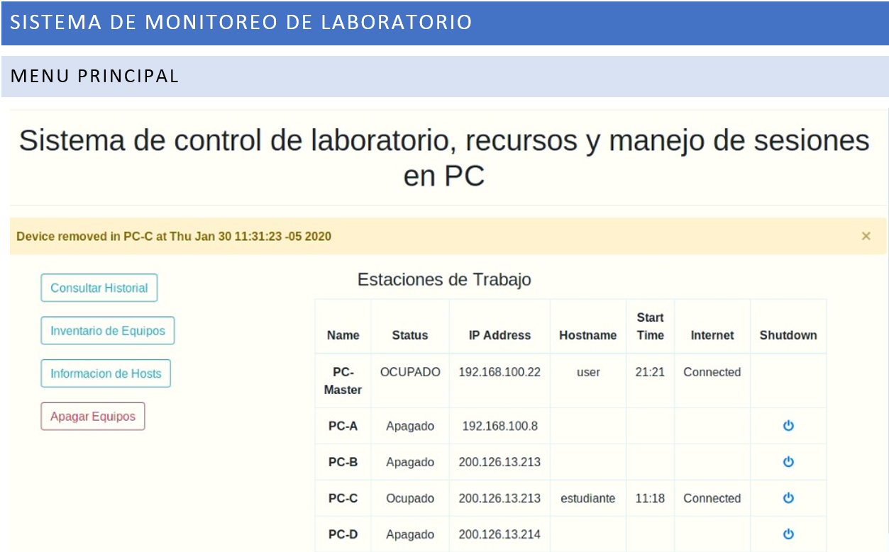

# SPA-Bash-Express-MongoDB-Python
Control system of a laboratory, resources and management of sessions on PC through a web application based on single page application

## Implemented Technologies
- **DataBase:** MongoDB
- **Backend:** Server Web(NodeJS with Express)
- **FrontEnd:** EJS with Bootstrap 
- **SO processes:** Bash and Python

